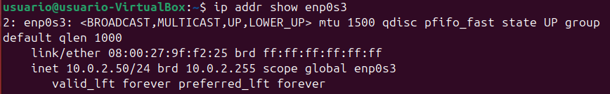
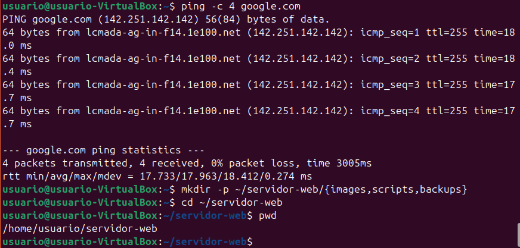
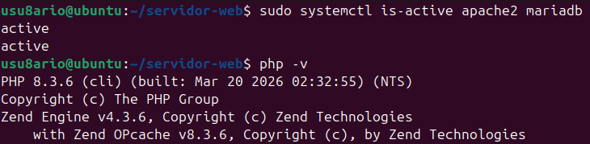
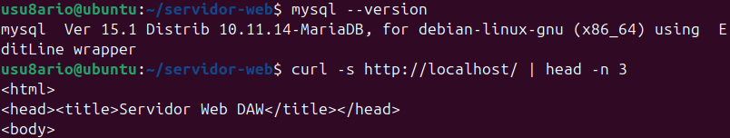
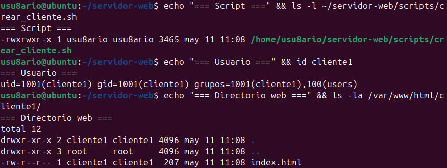
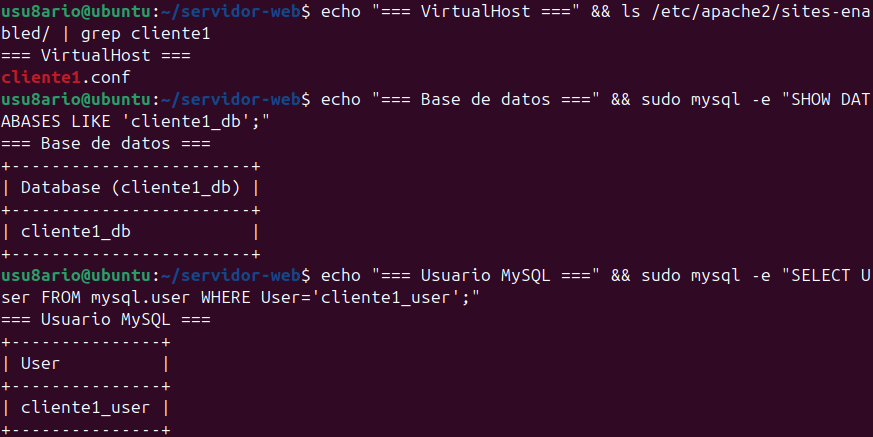
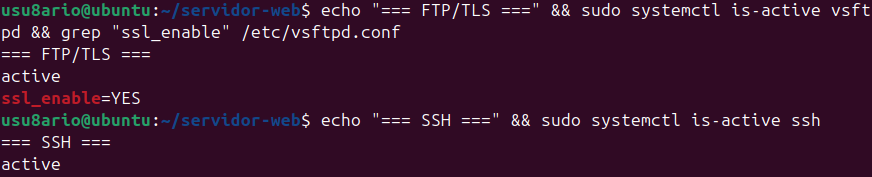
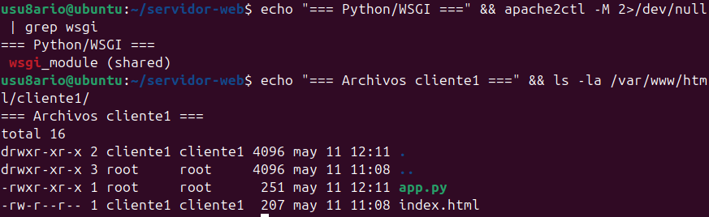
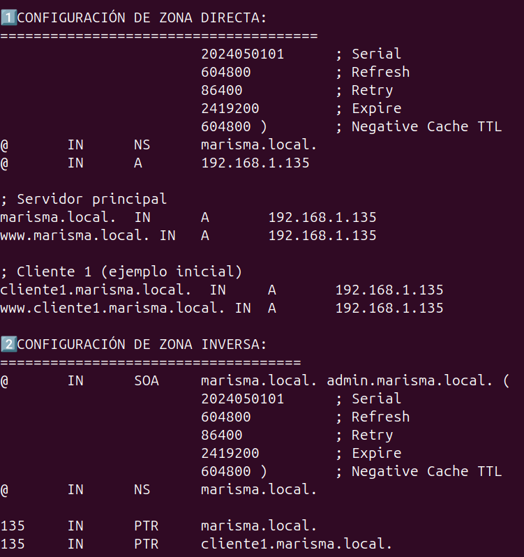
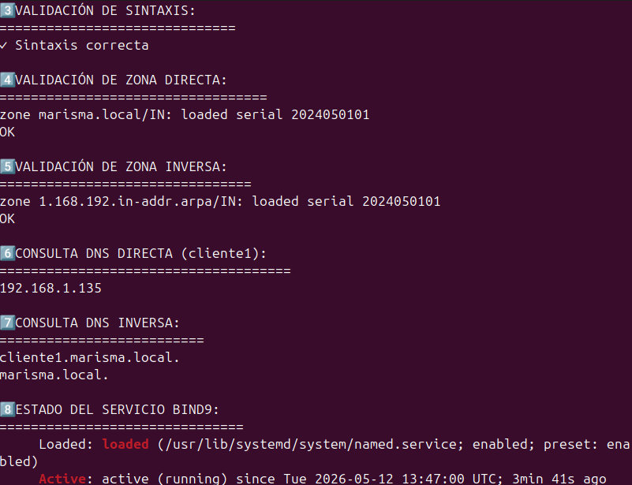

# 🌐 Proyecto Práctico - Infraestructura de Servidor Web y Servicios de Red (DAW 2025/26)

**Autor:** David Garrido Suárez

**Sistema Operativo:** Ubuntu Desktop 24.04 LTS sobre VirtualBox
**Configuración de red:** Adaptador Puente (Bridged Adapter)
**IP del servidor:** 192.168.1.135
**Dominio local:** `marisma.local`
**Directorio del proyecto:** `~/infraestructura-web/`

---

# 📑 Contenido

1. Configuración inicial del entorno
2. Instalación del stack Apache + PHP + MariaDB
3. Automatización de creación de clientes
4. Configuración FTP seguro, SSH y soporte Python
5. Implementación de servidor DNS con BIND9
6. Validaciones y pruebas finales
7. Uso práctico del servidor
8. Arquitectura y servicios desplegados

---

# ⚙️ 1. Preparación inicial del sistema

## 📝 Objetivo

Preparar el entorno Linux actualizando paquetes, instalando herramientas esenciales y organizando la estructura base del proyecto.

## 💻 Comandos utilizados

```bash
sudo apt update && sudo apt upgrade -y

sudo apt install -y \
net-tools curl wget vim git unzip

mkdir -p ~/infraestructura-web/{scripts,images,backups}

cd ~/infraestructura-web
```

## ✅ Resultado obtenido

* Sistema actualizado correctamente.
* Herramientas básicas instaladas.
* Conectividad de red comprobada.
* Estructura de trabajo preparada.




---

# 🌐 2. Instalación de Apache2, PHP y MariaDB

## 📝 Objetivo

Desplegar un entorno LAMP funcional para alojar aplicaciones web dinámicas y administrar bases de datos mediante phpMyAdmin.

## 💻 Instalación

```bash
sudo apt install -y apache2 mariadb-server mariadb-client \
php php-cli php-mysql php-curl php-gd php-xml php-mbstring php-zip \
libapache2-mod-php phpmyadmin
```

## 🔧 Configuración adicional

```bash
sudo systemctl enable apache2 mariadb
sudo systemctl start apache2 mariadb

sudo a2enmod rewrite ssl
sudo systemctl restart apache2

sudo ln -s /etc/phpmyadmin/apache.conf \
/etc/apache2/conf-available/phpmyadmin.conf

sudo a2enconf phpmyadmin
sudo systemctl reload apache2
```

## ✅ Resultado

* Apache2 operativo en puerto 80.
* PHP 8.3 configurado correctamente.
* MariaDB funcional.
* phpMyAdmin accesible desde navegador.




---

# 🤖 3. Automatización de clientes

## 📝 Objetivo

Desarrollar un script que automatice la creación de clientes web incluyendo:

* Usuario Linux
* Directorio web
* VirtualHost Apache
* Configuración DNS
* Base de datos MySQL

## 📂 Script utilizado

```bash
~/infraestructura-web/scripts/crear_cliente.sh
```

## ▶️ Ejecución

```bash
sudo ./crear_cliente.sh cliente1 192.168.1.135
```

## ✅ Funcionalidades automatizadas

* Creación de usuario del sistema
* Creación de directorio web personalizado
* Página inicial automática
* Configuración Apache VirtualHost
* Inserción DNS automática
* Creación de BD y usuario MySQL
* Generación de contraseña segura




---

# 🔐 4. FTP Seguro, SSH/SFTP y soporte Python

## 📝 Objetivo

Implementar acceso remoto seguro y permitir la ejecución de aplicaciones Python mediante Apache.

## 📦 Instalación

```bash
sudo apt install -y \
vsftpd \
openssh-server \
libapache2-mod-wsgi-py3
```

## 🔧 Configuración FTP

Archivo:

```bash
/etc/vsftpd.conf
```

Opciones habilitadas:

```bash
ssl_enable=YES
chroot_local_user=YES
```

## 🔥 Firewall

```bash
sudo ufw allow 21/tcp
sudo ufw allow 22/tcp
sudo ufw allow 40000:40100/tcp
```

## 🐍 Activar soporte Python

```bash
sudo a2enmod wsgi
sudo systemctl reload apache2
```

## ✅ Resultado

* FTP seguro mediante TLS.
* Acceso SSH y SFTP funcional.
* Aplicaciones Python ejecutándose vía mod_wsgi.




---

# 🌍 5. Configuración DNS con BIND9

## 📝 Objetivo

Implementar un servidor DNS autoritativo local con resolución directa e inversa.

## 📦 Instalación

```bash
sudo apt install -y \
bind9 bind9-utils bind9-doc dnsutils
```

## 🔧 Configuración

Archivo principal:

```bash
/etc/bind/named.conf.local
```

### Zonas configuradas

* `marisma.local`
* `1.168.192.in-addr.arpa`

## 🧪 Validaciones

```bash
sudo named-checkconf

sudo named-checkzone marisma.local \
/etc/bind/db.marisma.local
```

## 🔍 Pruebas DNS

```bash
dig @192.168.1.135 cliente1.marisma.local

dig @192.168.1.135 -x 192.168.1.135
```

## ✅ Resultado

* Resolución directa funcionando.
* Resolución inversa activa.
* Integración automática con el script de clientes.




---

# 🧪 6. Verificación integral del sistema

## 📋 Servicios comprobados

```bash
sudo systemctl status \
apache2 mariadb named vsftpd ssh
```

## 🌐 Prueba HTTP

```bash
curl http://192.168.1.135
```

## 🗄️ Verificación MySQL

```bash
sudo mysql -e "SHOW DATABASES;"
```

## 🌍 Prueba DNS

```bash
dig @192.168.1.135 cliente1.marisma.local +short
```

## 🔐 Verificación SSH

```bash
ssh cliente1@192.168.1.135
```

## ✅ Resultado final

Todos los servicios quedaron operativos y funcionando correctamente de forma integrada.

---

# 🚀 Cómo utilizar el servidor

## Crear un nuevo cliente

```bash
sudo ~/infraestructura-web/scripts/crear_cliente.sh empresa 192.168.1.135
```

## El sistema genera automáticamente

* Usuario Linux
* Directorio web
* VirtualHost
* Subdominio DNS
* Base de datos
* Usuario MySQL
* Contraseña aleatoria segura

---

# 🌐 Acceso a servicios

## Cliente web

```bash
http://empresa.marisma.local
```

## phpMyAdmin

```bash
http://192.168.1.135/phpmyadmin
```

## SSH

```bash
ssh empresa@192.168.1.135
```

## SFTP

```bash
sftp empresa@192.168.1.135
```

---

# 🏗️ Arquitectura del entorno

| Servicio      | Tecnología | Puerto   |
| ------------- | ---------- | -------- |
| Servidor Web  | Apache2    | 80 / 443 |
| PHP           | PHP 8.3    | Interno  |
| Base de Datos | MariaDB    | 3306     |
| DNS           | BIND9      | 53       |
| FTP Seguro    | vsftpd     | 21       |
| Acceso remoto | OpenSSH    | 22       |
| Python WSGI   | mod_wsgi   | Apache   |

---

# 🔒 Medidas de seguridad aplicadas

* FTP protegido con TLS
* Usuarios aislados mediante chroot
* Acceso remoto mediante SSH/SFTP
* Contraseñas aleatorias seguras
* Separación de bases de datos por cliente
* Validación automática de zonas DNS
* Permisos seguros en directorios web

---

# 📁 Organización del proyecto

```bash
~/infraestructura-web/
├── README.md
├── scripts/
├── images/
└── backups/
```

---

# ✅ Objetivos de la práctica completados

✔ Instalación de servidor web configurable
✔ Hosting de sitios dinámicos y estáticos
✔ Automatización mediante scripts
✔ Configuración DNS local
✔ Integración MariaDB + phpMyAdmin
✔ Acceso FTP seguro con TLS
✔ SSH y SFTP operativos
✔ Soporte Python mediante mod_wsgi
✔ VirtualHosts automáticos
✔ Gestión multiusuario

---

# 🎓 Datos del entorno

* Ubuntu 24.04 LTS
* VirtualBox
* Red en modo puente
* Arquitectura x86_64
* Dominio local: `marisma.local`

---

# 📌 Estado del proyecto

| Estado               | Resultado      |
| -------------------- | -------------- |
| Configuración Apache | ✅ Correcta     |
| Configuración DNS    | ✅ Correcta     |
| Bases de datos       | ✅ Operativas   |
| VirtualHosts         | ✅ Funcionando  |
| FTP/SSH              | ✅ Activos      |
| Automatización       | ✅ Implementada |

---
